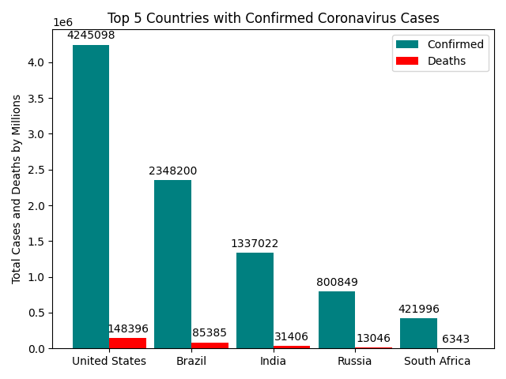

# coronavirusScrap
Python script used for web-scrapping a website that displays total corona virus cases in different countries around the world

It will generate a bar graph that displays total confirmed and death cases from the top 5 countries with the most coronavirus cases.

# Plans
Hoping to make the code more modular and making a seperate bar graphs option for total confirmed and deaths. 

# Example Output

