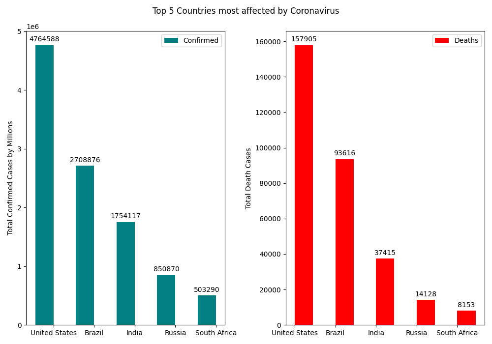

# Coronavirus_Scrape
Python script used for web-scraping a [website](https://www.worldometers.info/coronavirus/countries-where-coronavirus-has-spread/) that displays total corona virus cases in different countries around the world

It will generate a bar graph that displays total confirmed and death cases from the top 5 countries with the most coronavirus cases.

# Plans
Hoping to make the code more modular/cleaner and expanding the project to include data on a global map. Also planning on adding an option to graph data based on specific continents.

# Example Output

